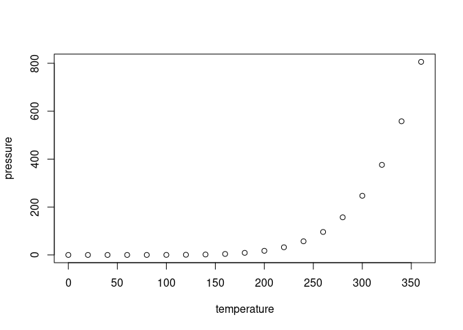

<!-- README.md is generated from README.Rmd. Please edit that file -->

# EBEx

<!-- badges: start -->
<!-- badges: end -->

EBEx is a R package that integrates an **E**nsemble-**B**ased
**Ex**plainable AI pipeline for prioritising disease relevant genes from
transcriptomic data, using Chronic Obstructive Pulmonary Disease (COPD)
as a use case. The proposed pipeline allows the identification of
COPD-associated genes that are less sensitive to disease heterogeneity
than classical case-control approaches such as Differential Expression
Analysis.

## Installation

You can install the development version of EBEx from
[GitHub](https://github.com/) directly in R with:

``` r
if (!require("remotes")) install.packages("remotes")
remotes::install_github("iposelag/EBEx")
```

## Study Overview

This work presents a computational pipeline built upon an ensemble of
explainable AI methods. Framed as a patients vs. control predictive
task, the approach identifies candidate markers, including genes with
general effects on disease status as well as genes associated with
specific patient subgroups. To maximise sensitivity, the pipeline
integrates predictions from well-established ML classifiers–such as
Random Forest (RF) and Support Vector Machines (SVM)–trained on
multiple, complementary candidate gene lists. These lists comprise genes
with strong signal-to-noise ratios derived from univariate analyses,
including DEA, together with genes previously reported in the
literature. Importantly, the initial lists are expanded to include
additional genes acting within the same biological pathways, which may
contribute to disease through shared molecular mechanisms. Model
explainability scores are used to evaluate the contribution of each
gene, enabling the prioritisation of those with the highest predictive
value while deprioritising less informative candidates. By aggregating
sample-specific explainability scores across classifiers and gene lists,
the pipeline captures gene contributions from multiple methodological
perspectives. This methodological diversity contributes decisively to
the results, as it allows us in turn to identify COPD-relevant genes
that, due to the molecular heterogeneity inherent to the disease, are
usually neglected by most specific classifiers and gene lists.

## Documentation

Visit EBEx/docs/reference/index.html to check the package documentation
and tutorials.

## Vingettes

Comming soon!

## Citation

Comming soon!

\#####################33 DIrty

``` r
library(EBEx)
## basic example code
```

What is special about using `README.Rmd` instead of just `README.md`?
You can include R chunks like so:

``` r
summary(cars)
#>      speed           dist       
#>  Min.   : 4.0   Min.   :  2.00  
#>  1st Qu.:12.0   1st Qu.: 26.00  
#>  Median :15.0   Median : 36.00  
#>  Mean   :15.4   Mean   : 42.98  
#>  3rd Qu.:19.0   3rd Qu.: 56.00  
#>  Max.   :25.0   Max.   :120.00
```

You’ll still need to render `README.Rmd` regularly, to keep `README.md`
up-to-date. `devtools::build_readme()` is handy for this.

You can also embed plots, for example:



In that case, don’t forget to commit and push the resulting figure
files, so they display on GitHub and CRAN.
