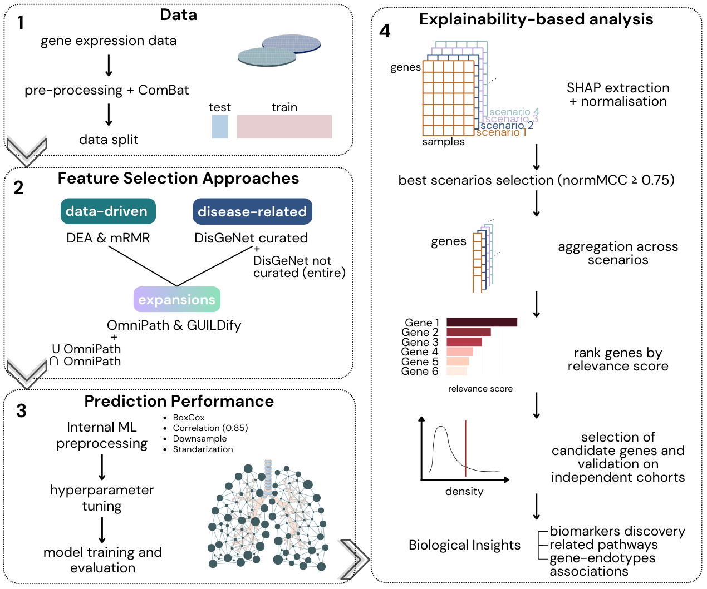

# EBEx

EBEx is a R package that integrates an **E**nsemble-**B**ased
**Ex**plainable AI pipeline for prioritising relevant genes of complex
diseases from transcriptomic data, using Chronic Obstructive Pulmonary
Disease (COPD) as a use case. We hypothesise that no single classifier
is universally optimal for modelling a heterogeneous disease such as
COPD. Therefore, we formulated COPD molecular analysis as a supervised
prediction task (case vs. control) and implemented an explainable
ensemble-based ML framework to identify robust and biologically
meaningful gene signatures.

## Installation

You can install the development version of EBEx from
[GitHub](https://github.com/) directly in R with:

``` r
if (!require("remotes")) install.packages("remotes")
remotes::install_github("iposelag/EBEx")
```

## Study Overview



This work presents a computational pipeline based on an ensemble of
explainable AI methods for the identification of robust COPD-associated
genes.

We formulate COPD molecular analysis as a supervised prediction task
(patients vs. controls). Within this framework, the pipeline identifies
candidate markers capturing genes with general effects on disease status
as well as genes associated with specific patient subgroups.

To maximise sensitivity and robustness, the approach integrates
predictions from **multiple well-established ML classifiers**, including
Random Forest (RF) and Support Vector Machines (SVM). These models are
trained on several **complementary candidate gene lists**. The candidate
lists include:

- Genes with strong signal-to-noise ratios derived from univariate
  analyses (**DEA**) and using multivariate strategies (**mRMR**)
- Genes previously reported in the literature (**DisGeNET**)
- Additional genes belonging to the same biological pathways, allowing
  the capture of shared molecular mechanisms that may contribute to
  disease (**OmniPath, GUILDify**)

**Model explainability** scores are used to quantify the contribution of
each gene to the predictive task. For each scenario, sample-specific
absolute explainability scores are:

1.  Normalised  
2.  Aggregated by gene
3.  Combined across modelling scenarios using the maximum score

This aggregation strategy captures gene relevance from multiple
methodological perspectives. The resulting **relevance scores** are
ranked to define the final candidate gene set, which is subsequently
validated in independent cohorts.

The methodological diversity embedded in the pipeline is central to its
performance. By integrating classifiers, gene lists, and explainability
metrics, the framework is able to recover COPD-relevant genes that may
be overlooked by single models or narrowly defined feature sets. This is
particularly important given the molecular heterogeneity inherent to
COPD. Finally, the predictive signals are translated into biological
insight, enabling:

- Identification of potential **biomarkers**  
- Characterisation of **regulatory mechanisms**  
- Definition of molecular COPD **endotypes**

## Documentation

Visit EBEx/docs/reference/index.html to check the package documentation
and tutorials.

## Vingettes

Comming soon!

## Citation

Comming soon!
