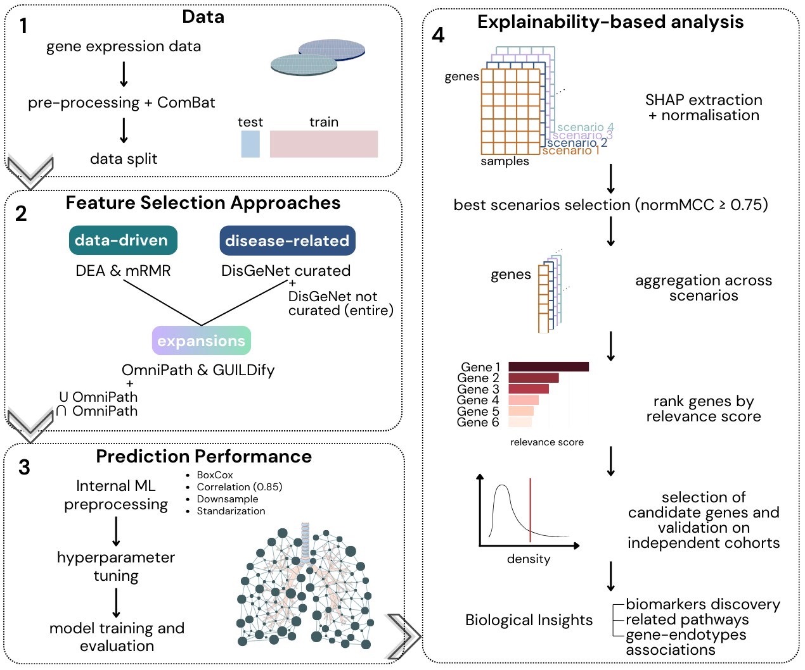

```{r, include = FALSE}
knitr::opts_chunk$set(
  collapse = TRUE,
  comment = "#>"
)
```

## Overview

EBEx implements a multi-step machine learning pipeline for prioritising 
disease-relevant genes from transcriptomic data, using Chronic Obstructive 
Pulmonary Disease (COPD) as a use case. The framework is designed for 
high-dimensional, low-sample-size settings where interpretability and robustness 
are prioritised over model complexity.

<p align="center">
  
</p>

## Design Rationale

EBEx is built on the premise that no single classifier is universally optimal 
for modelling a heterogeneous disease such as COPD. EBEx aggregates normalised 
SHAP-based relevance scores across multiple independent classifier-gene list 
combinations to derive a unified and robust gene relevance ranking.

We formulate COPD molecular analysis as a supervised prediction task (patients vs. controls). 
Within this framework, the pipeline identifies candidate markers capturing genes 
with general effects on disease status as well as genes associated with specific 
patient subgroups.

To maximise sensitivity and robustness, the approach integrates predictions from 
**multiple well-established ML classifiers**, including Random Forest (RF) and Support Vector Machines (SVM). 
These models are trained on several **complementary candidate gene lists**. 
The candidate lists include:

- Genes with strong signal-to-noise ratios derived from univariate analyses (**DEA**) and using multivariate strategies (**mRMR**)
- Genes previously reported in the literature (**DisGeNET**)
- Additional genes belonging to the same biological pathways, allowing the capture of shared molecular mechanisms that may contribute to disease (**OmniPath, GUILDify**)

**Model explainability** scores are used to quantify the contribution of each gene to the predictive task. For each scenario, sample-specific absolute explainability scores are:

1. Normalised
2. Aggregated by gene
3. Combined across modelling scenarios using the maximum score

This aggregation strategy captures gene relevance from multiple methodological perspectives. 
The resulting **relevance scores** reflect each gene's predictive importance across modelling 
configurations and are ranked to define the final candidate gene set, which is subsequently 
validated in independent cohorts.  

The methodological diversity embedded in the pipeline is central to its performance. 
By integrating classifiers, gene lists, and explainability metrics, the framework is 
able to recover COPD-relevant genes that may be overlooked by single models or narrowly
defined feature sets. This is particularly important given the molecular heterogeneity 
inherent to COPD. Finally, the predictive signals are translated into biological insight, 
enabling:

- Identification of potential **biomarkers**
- Characterisation of **regulatory mechanisms**
- Definition of molecular COPD **endotypes**

## Pipeline Overview
The package is organised into 13 functional modules and an accompanying set of 12 analysis scripts 
that implement the full workflow. The pipeline proceeds in sequential steps: 

(i) stratified train/test splitting (`prepreocess.R`)   
(ii) multi-procedure feature selection integrating DEA (`dea.R`), mRMR, and prior knowledge databases including DisGeNET and OmniPath (`feature_selection.R`)  
(iii) supervised classification using six algorithms — Random Forest, k-Nearest Neighbours, SVM with radial and polynomial kernels, logistic regression, and XGBoost — with Bayesian hyperparameter optimisation and cross-validation (`fit_models.R`)  
(iv) SHAP-based per-sample explainability using DALEX (`explainability.R`)  
(iv.i) normalisation and aggregation of SHAP scores across models and input scenarios, followed by threshold-based gene selection via density analysis or Gaussian mixture modelling (`aggregation.R`, `density_ranking.R`, `mclust_ranking.R`)  
(iv.ii) downstream characterisation of candidate genes through phenotype association testing, pathway enrichment, patient subgroup clustering, and cross-tissue validation against GTEx (`enrichment_phenotype.R`, `functional_enrichment.R`, `clustering.R`)  

A dedicated visualisation module (`plots.R`) produces publication-ready figures throughout.
